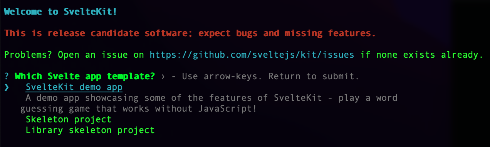
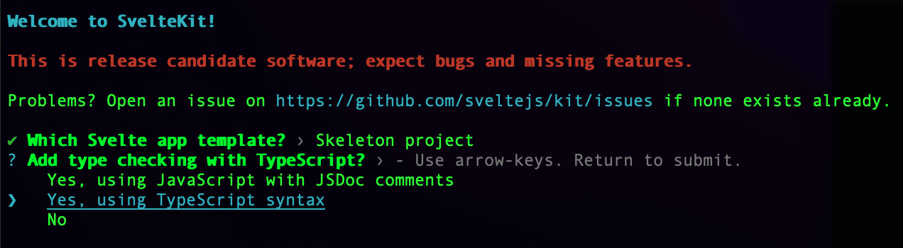
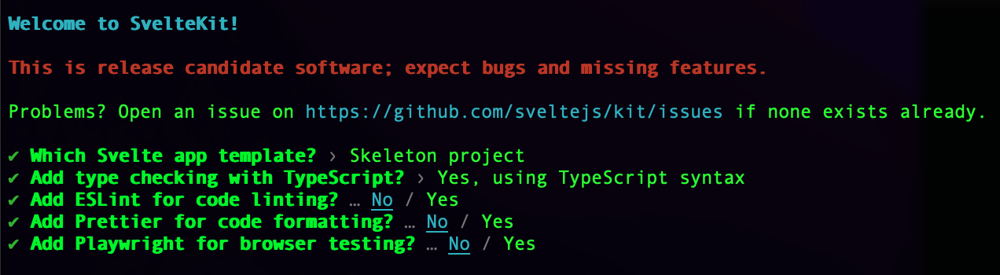

### Package to add svelteCMS to your svelte kit project
#### Step 1: create a svelteKit project
``` bash
npm create svelte@latest appName
cd appName
```

### Make sure you select TypeScript
##### Since svelteCMS uses TypeScript to auto generate routes and routes objects types

### Next, choose your app config

### Or just add svelteCMS to an existing using npx
``` bash
npx sveltecms-init
```
### Init takes some optionals params
``` bash
# The connection url to your mongoDB database
--dbUrl=mongodb_url
# Example
npx sveltecms-init --dbUrl=mongodb+srv://someUrl:<password>-@user.mongodb.net/
```
#### Step 2: run npx command
``` bash
npx sveltecms-init
# or pass your mongodb url
npx sveltecms-init --dbUrl=mongodb_url
```